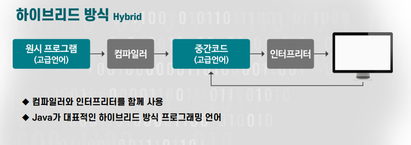

# 9주차: 프로그래밍 언어를 이용한 컴퓨터와의 소통

## 프로그래밍 언어

- 기계 중심의 저급 엉어(Low-level language)
  - 기계어(Machine language)
    - 컴퓨터 내부의 동작을 0,1로 표현
    - 처리속도 빠름
    - 다른 컴퓨터와 호환 X, 하드웨어에 종속적
  - 어셈블리어
  - 
    - 기계명령을 알기쉬운 기호로 표현
    - 하드웨어를 직접 제어하는 용도로 활용
- 고급 언어(high-level)
  - 문법구조와 데이터 구조화에 대한 규칙이 있음
  - 접근성이 용이하도록 만들어진 인공적인 언어

## 프로그램의 실행방법

- 고급언어로 작성된 프로그램을 기계어로 번역해서 컴퓨터 실행

- 컴파일러 방식

- 인터프리터 방식

- 하이브리드 방식

## 랩터(RAPTOR)

- 전투기 조종사들의 코딩교육을 위해 개발된 프로그래밍 언어
- 순서도를 기반으로 알고리즘을 구성하고 실행하는 비주얼 프로그래밍 언어

- 설치: https://raptor.martincarlisle.com/

#### 랩터의 장점

- 알고리즘의 흐름을 이해하고 개선하기 쉬움
- 랩터로 작성한 순서도는 C, 파이썬을 이용한 코드 작성의 기초 자료로 활용 가능
- 고급 프로그래밍 언어로 변환될 수 있는 기능 탑재

## 알고리즘

- 주어진 문제를 해결하기 위해 일련의 논리적인 절차나 방법을 체계적으로 표현하는 것

### 논리적 절차

- 명확성
  - 기술된 명령이 한 가지 이상의 의미를 포함하지 않도록 함
- 효과성
  - 기술된 명령은 반드시 주어진 상황에 영향을 주어서 실제로 상황을 변화시키는 효과가 있어야 함
- 입력과 출력
  - 적어도 한 가지 이상의 문제 해결 결과에 따른 출력이 반드시 생성되어야 함
- 유한성
  - 알고리즘에 있는 명령이 수행되면 한정된 단계를 처리한 후에 반드시 종료되어야 함

## 랩터

- 배정(Assignment)
- 프로시저 호출(call)
  - 함수라고도 함

## 알고리즘

- 추상화
  - 정보를 재구성하고 필요한 속성으로 간소화
- 알고리즘 생성
  - 문제 해결을 위한 프로세스를 생성
- 프로그래밍
  - 알고리즘 구현

## 프로그램 논리

- 선택논리 
	- if, else구문
	
- 반복논리
	- Loop문, while, for
	

# 10주차: 순서도와 알고리즘 구현

## 변수(Variable)

- 변하는 또는 변할 수 있는 어떤 것
- 데이터 기억장소, 데이터 운반자

## 식별자(Identifier)

- 변수를 구분하고 관리
- 데이터의 특징을 반영하여 식별자의 이름을 지음

## 선언(Declaration)

## 데이터 연산

## 관계 연산과 논리 연산

- 관계 연산 : 부등호, ==
- 논리 연산: and, or, not. xor 등
